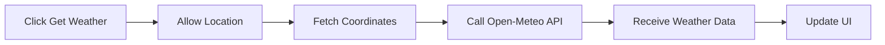

<!-- HERO SECTION -->
<h1 align="center">🌦️ WeatherNow</h1>

<p align="center">
  <b>Real-Time Weather App using Geolocation & Open-Meteo API</b><br/>
  <i>Modern • Responsive • Glassmorphism UI</i>
</p>

<p align="center">
  
  
  
  
  
</p>

---

## ✨ Features

<div align="center">

✔️ Real-time weather using live location  
✔️ Temperature in Celsius  
✔️ Weather condition display  
✔️ Wind speed & direction  
✔️ Smooth animations  
✔️ Glassmorphism UI  
✔️ Responsive design  
✔️ User-friendly error handling  

</div>

---

## 🧠 How It Works



---

## 🛠️ Tech Stack

<table align="center">
<tr>
<th>Technology</th>
<th>Purpose</th>
</tr>
<tr>
<td><b>HTML5</b></td>
<td>Structure</td>
</tr>
<tr>
<td><b>CSS3</b></td>
<td>Glassmorphism UI + Animations</td>
</tr>
<tr>
<td><b>JavaScript</b></td>
<td>Logic & API handling</td>
</tr>
<tr>
<td><b>Geolocation API</b></td>
<td>User location</td>
</tr>
<tr>
<td><b>Open-Meteo API</b></td>
<td>Weather data</td>
</tr>
</table>

---

## 📂 Project Structure

```bash
WeatherNow/
│── index.html
│── style.css
│── script.js
│── README.md
```

---

## 🔌 API Used

```http
GET https://api.open-meteo.com/v1/forecast
    ?latitude={lat}
    &longitude={lon}
    &current_weather=true
```

✅ No API key required

---

## 🚀 Run Locally

### 🔹 Method 1

```bash
git clone https://github.com/your-username/weathernow.git
cd weathernow
open index.html
```

Allow location permission when prompted.

---

### 🔹 Method 2 — VS Code Live Server

```bash
Right click → index.html → Open with Live Server
```

---

## ⚠️ Error Handling

The app handles:

- Geolocation not supported  
- Permission denied  
- Position unavailable  
- Timeout errors  
- API fetch failure  

All errors are shown with a styled alert UI.

---

## 🎨 UI Highlights

<div align="center">

🌫️ Glassmorphism card  
🌡️ Large temperature display  
📍 Dynamic coordinates  
📅 Current date  
💨 Wind info panel  
✨ Smooth entry animations  

</div>

---

## 🔮 Future Enhancements

- 🌍 Show city name (reverse geocoding)  
- 🌡️ °C ↔ °F toggle  
- 📅 5-day forecast  
- 💧 Humidity & pressure  
- 🌙 Dark/Light mode  
- 📱 PWA support  

---

## 👨‍💻 Author

<p align="center">
<b>Nirmalya Kumar Mohanty</b><br/>
CSE Student • Web Developer • Java Backend Learner
</p>

---

## ⭐ Support

If you like this project:

<p align="center">
⭐ Star the repo &nbsp;&nbsp;|&nbsp;&nbsp; 🍴 Fork it &nbsp;&nbsp;|&nbsp;&nbsp; 🚀 Build on it
</p>

---

## 📄 License

Free for learning and personal projects.
